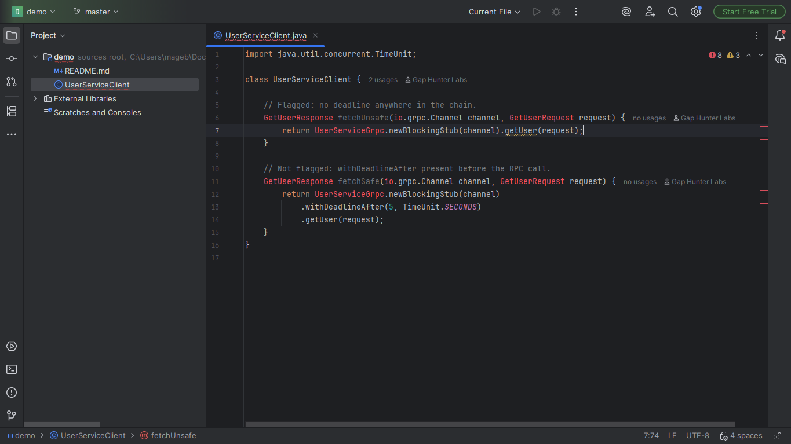
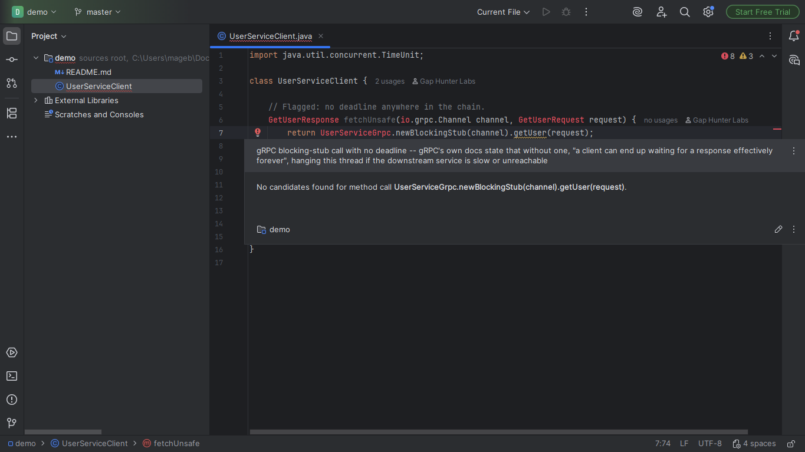

# gRPC Missing Deadline Companion

Warning on an RPC call made through a generated gRPC blocking stub
(`XxxGrpc.newBlockingStub(channel)....call(request)`) whose
stub-construction chain never passes through
`.withDeadline(...)`/`.withDeadlineAfter(...)`.

## Screenshots





## Why it exists

gRPC's own documentation states plainly that "by default, gRPC does
not set a deadline... a client can end up waiting for a response
effectively forever" -- a slow or unreachable downstream service hangs
the caller's thread indefinitely, propagating failures in cascade. The
official gRPC Marketplace plugin gives protobuf/RPC execution support,
not a correctness check for deadlines; no Marketplace plugin found
dedicated to this.

## Why built this way

- Walks the real stub-construction call chain from `newBlockingStub(...)`
  to the actual RPC invocation, recognizing `.withDeadline(...)`/
  `.withDeadlineAfter(...)` anywhere along the way -- not just
  immediately before the RPC call.
- Only flags the TERMINAL call in a chain -- a dead-end chain that
  never actually invokes an RPC method (e.g. building a stub to return
  it) is never flagged.

## v0.1 scope — stated honestly, not exhaustively

Only the synchronous client (`newBlockingStub`) -- the async/reactive
case (`newStub`/`newFutureStub`) propagates deadlines via `Context`
instead of a builder chain, a structurally different mechanism
deferred to a future version.

## Usage

Open any Java file using a generated gRPC blocking stub. An RPC call
with no deadline in its construction chain shows a warning on the call.

## Support

- **Bugs and feature requests:** [GitHub Issues](https://github.com/GapHunterLabs/grpc-missing-deadline-companion/issues)
- **Questions, or custom rules for a team's codebase:** **gaphunterlabs@gmail.com**
- **Security vulnerabilities:** report privately as described in [SECURITY.md](SECURITY.md), not in a public issue.
- **Privacy and network behavior:** [PRIVACY.md](PRIVACY.md)

## Development

```
./gradlew test           # unit tests
./gradlew buildPlugin    # generates build/distributions/*.zip
./gradlew verifyPlugin   # checks compatibility against real IDEs
```

## License

Apache-2.0. See `LICENSE`.
